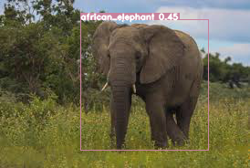
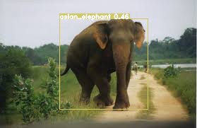

# Elephant Detector - YOLOv4

This repository contains an Elephant Object Detection model and weights.  
The model will attempt to differentiate between African and Asian elephants.  
The model is built on a Keras implementation of YOLOv4 written by [taipingeric](https://github.com/taipingeric/yolo-v4-tf.keras).  
This repository is NOT a training tutorial, it is a functional pretrained object detector.





---

## Installation

A requirements.txt file has been provided.  
Once the repository has been cloned, create a new conda environment:

```bash
cd ElephantDetector
conda create env --name elephantdet --file requirements.txt
conda activate elephantdet
```

---

## Usage

Run inference from the command line:  

```bash
python predict.py --input INPUT_PATH 
```
